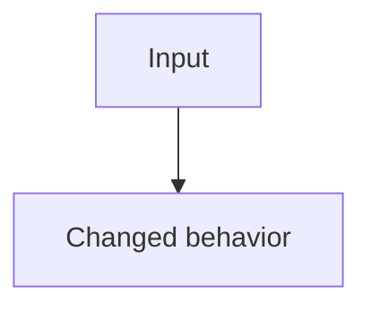

<!-- tofarev:v1:eyJ2ZXJzaW9uIjoxLCJrZXkiOiIyOTA5NjA1MjE6MSIsInJlcG9zaXRvcnkiOiJzcmwtbGFicy9jb250YWluZXJsYWIiLCJyZXBvc2l0b3J5SWQiOjI5MDk2MDUyMSwicHIiOjEsInRyaWdnZXJJZCI6MSwiaGVhZCI6ImFhYWFhYWFhYWFhYWFhYWFhYWFhYWFhYWFhYWFhYWFhYWFhYWFhYWEiLCJiYXNlIjoiYmJiYmJiYmJiYmJiYmJiYmJiYmJiYmJiYmJiYmJiYmJiYmJiYmJiYiIsIm1lcmdlQmFzZSI6ImJiYmJiYmJiYmJiYmJiYmJiYmJiYmJiYmJiYmJiYmJiYmJiYmJiYmIiLCJwb2xpY3kiOiJkZGRkZGRkZGRkZGRkZGRkZGRkZGRkZGRkZGRkZGRkZGRkZGRkZGRkZGRkZGRkZGRkZGRkZGRkZGRkZGRkZGRkIiwicnVuVXJsIjoiaHR0cHM6Ly9naXRodWIuY29tL3NybC1sYWJzL2NvbnRhaW5lcmxhYi9hY3Rpb25zL3J1bnMvMSIsInN0YXRlIjoicGFydGlhbCJ9 -->
## ToFaRev review — partial

Reviewed [aaaaaaaaaaaa](https://github.com/srl-labs/containerlab/commit/aaaaaaaaaaaaaaaaaaaaaaaaaaaaaaaaaaaaaaaa) · [Workflow run](https://github.com/srl-labs/containerlab/actions/runs/1)

**Partial review. The findings below do not cover all changes.**

| Finding | Location |
| --- | --- |
| **P0 - Example finding at P0** | [core/lab.go:1-1](https://github.com/srl-labs/containerlab/blob/aaaaaaaaaaaaaaaaaaaaaaaaaaaaaaaaaaaaaaaa/core/lab.go#L1-L1) |
| **P1 - Example finding at P1** | [core/lab.go:2-2](https://github.com/srl-labs/containerlab/blob/aaaaaaaaaaaaaaaaaaaaaaaaaaaaaaaaaaaaaaaa/core/lab.go#L2-L2) |
| **P2 - Example finding at P2** | [core/lab.go:3-3](https://github.com/srl-labs/containerlab/blob/aaaaaaaaaaaaaaaaaaaaaaaaaaaaaaaaaaaaaaaa/core/lab.go#L3-L3) |
| **P3 - Example finding at P3** | [core/lab.go:4-4](https://github.com/srl-labs/containerlab/blob/aaaaaaaaaaaaaaaaaaaaaaaaaaaaaaaaaaaaaaaa/core/lab.go#L4-L4) |
| **P4 - Example finding at P4** | [core/lab.go:5-5](https://github.com/srl-labs/containerlab/blob/aaaaaaaaaaaaaaaaaaaaaaaaaaaaaaaaaaaaaaaa/core/lab.go#L5-L5) |

## Detailed findings:

P0 - Example finding at P0

**Location:** [core/lab.go:1-1](https://github.com/srl-labs/containerlab/blob/aaaaaaaaaaaaaaaaaaaaaaaaaaaaaaaaaaaaaaaa/core/lab.go#L1-L1)

**Problem:** Illustrative issue; this is not a review of real Containerlab code.

**Trigger:** The changed branch receives the input described here.

**Impact:** Describe a concrete consequence and justify severity.

**Suggested correction:** Describe the smallest practical correction.

P1 - Example finding at P1

**Location:** [core/lab.go:2-2](https://github.com/srl-labs/containerlab/blob/aaaaaaaaaaaaaaaaaaaaaaaaaaaaaaaaaaaaaaaa/core/lab.go#L2-L2)

**Problem:** Illustrative issue; this is not a review of real Containerlab code.

**Trigger:** The changed branch receives the input described here.

**Impact:** Describe a concrete consequence and justify severity.

**Suggested correction:** Describe the smallest practical correction.

P2 - Example finding at P2

**Location:** [core/lab.go:3-3](https://github.com/srl-labs/containerlab/blob/aaaaaaaaaaaaaaaaaaaaaaaaaaaaaaaaaaaaaaaa/core/lab.go#L3-L3)

**Problem:** Illustrative issue; this is not a review of real Containerlab code.

**Trigger:** The changed branch receives the input described here.

**Impact:** Describe a concrete consequence and justify severity.

**Suggested correction:** Describe the smallest practical correction.

P3 - Example finding at P3

**Location:** [core/lab.go:4-4](https://github.com/srl-labs/containerlab/blob/aaaaaaaaaaaaaaaaaaaaaaaaaaaaaaaaaaaaaaaa/core/lab.go#L4-L4)

**Problem:** Illustrative issue; this is not a review of real Containerlab code.

**Trigger:** The changed branch receives the input described here.

**Impact:** Describe a concrete consequence and justify severity.

**Suggested correction:** Describe the smallest practical correction.

P4 - Example finding at P4

**Location:** [core/lab.go:5-5](https://github.com/srl-labs/containerlab/blob/aaaaaaaaaaaaaaaaaaaaaaaaaaaaaaaaaaaaaaaa/core/lab.go#L5-L5)

**Problem:** Illustrative issue; this is not a review of real Containerlab code.

**Trigger:** The changed branch receives the input described here.

**Impact:** Describe a concrete consequence and justify severity.

**Suggested correction:** Describe the smallest practical correction.

review conditions

Source inspection only; PR code, tests, and benchmarks were not executed.

- Some changed files were omitted.

---
Powered by <a href="https://tokenfactory.nebius.com/"><picture><source media="(prefers-color-scheme: dark)" srcset="https://raw.githubusercontent.com/hellt/tofarev/11341daf301af9b89b711528df08d0a9e9139bca/assets/nebius-token-factory-dark.svg"></picture></a>
